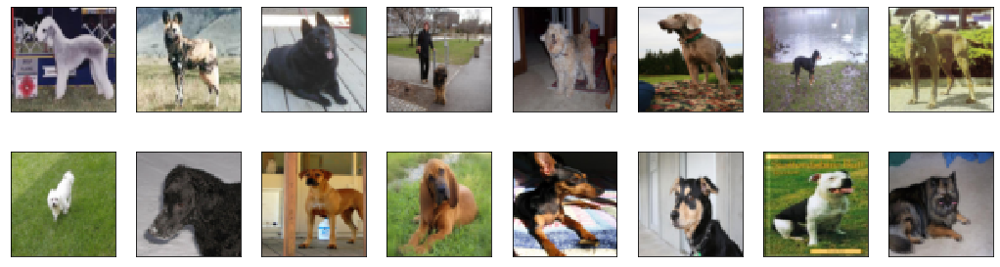
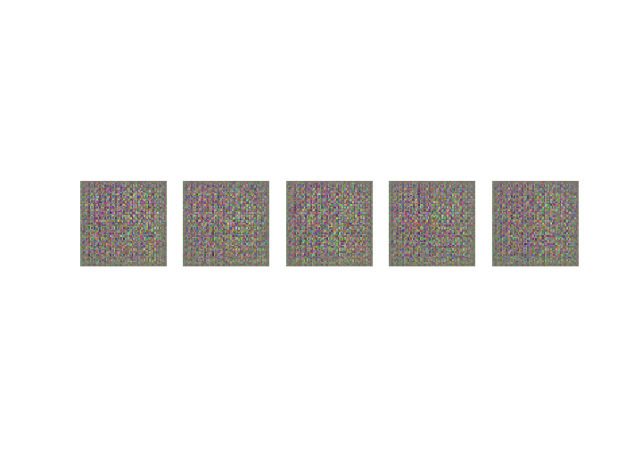
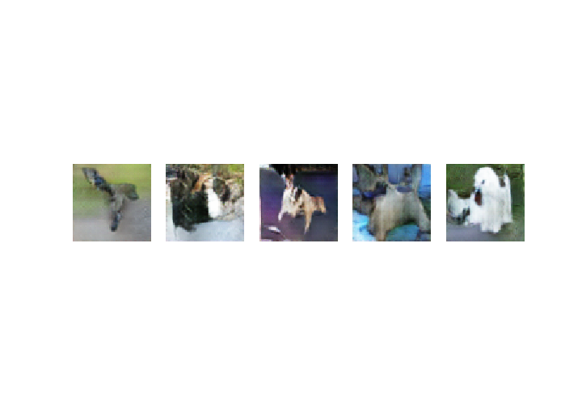
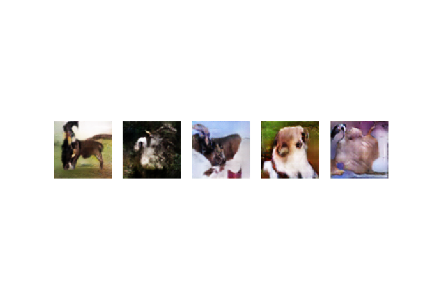

# DCGAN-Pytorch
Implementation of [DCGAN](https://arxiv.org/abs/1511.06434) on Pytorch framework and trained on The Stanford Dogs Dataset.
## DCGAN

In reality, it is very hard to train GANs as its training is very unstable and requires a careful selection of hyperparameters.

**DCGANS** try to solve some of the problems of GANs by using ConvNets in the Generator and Discriminator. The paper also proposes some architectual contraints on the ConvNets that helps stabilize GAN training. Some of these constraints are:

1) The generator uses **tanh** activation in the final layer while the discriminator uses **leaky-relu** activation in all the layers.

2) Using only convolutional layers in the Generator and the Discriminator by increasing the stride.

3) Using BatchNormalization in both the Generator and the Discriminator during training.

**Tweaks from my side include** 
- Using Soft labels, i.e., to to put the two target labels, Real = 0.9 and Fake = 0.1, instead of 1 and 0 respectively.
- Training Discriminator in 2 parts, i.e, first on real images and then on fake(generated) images.

## Dataset
[The Stanford Dogs Dataset](https://www.kaggle.com/c/generative-dog-images/data)

## Training Images

## Training Visualisation
Epoch 1:

Epoch 25:

Epoch 49:

